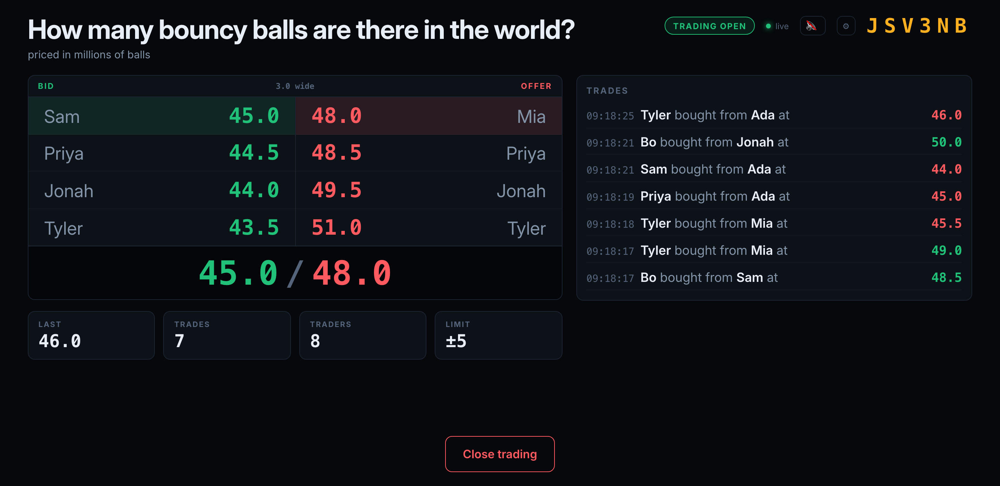
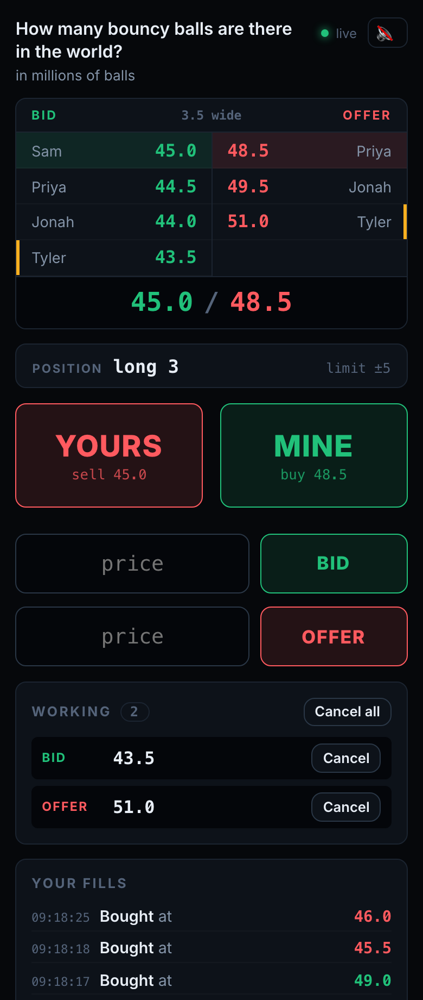
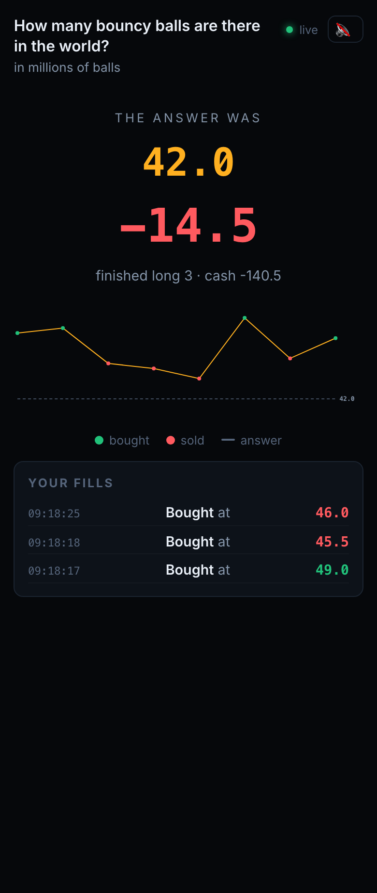
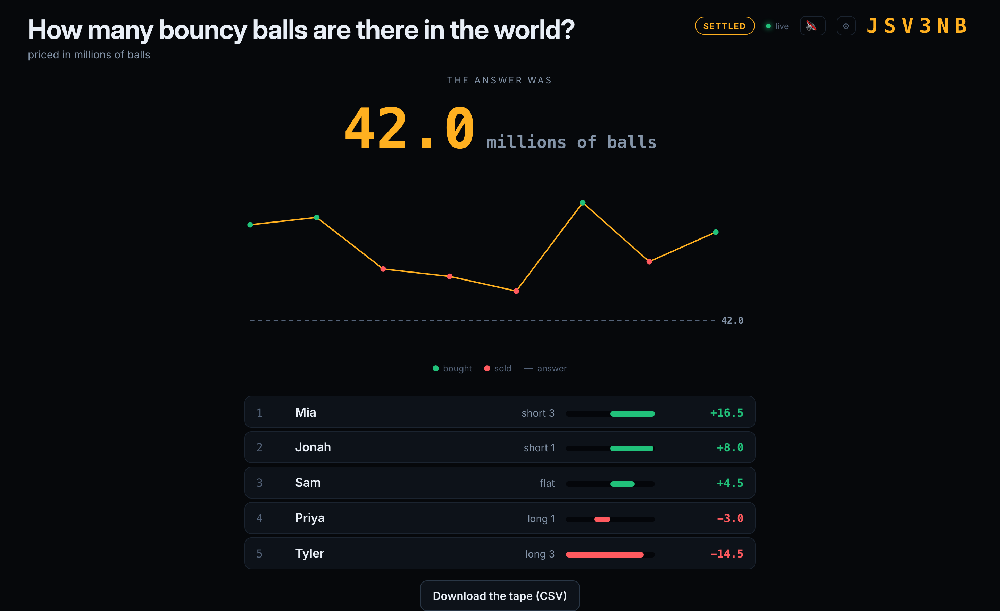

# Open Outcry

Open Outcry runs an open-outcry trading game for a group of people in one room.
One person hosts and projects the order book on a screen; everyone else joins
from a phone by scanning a QR code. The group trades a contract on a question
with a hidden numeric answer — for example, how many bouncy balls there are in
the world. When the host closes trading and enters the real answer, every
position settles against it.

Sessions require no accounts. The host creates one and reads out a
six-character code.

<!-- If you fork this or rename the repo, update the CI badge path below. -->
[](https://github.com/TylerIllman/OpenOutcry/actions/workflows/ci.yml)
[](LICENSE)

Running at <https://openoutcry.tyleri.dev>.



## Contents

- [The game](#the-game)
- [Architecture](#architecture)
- [The matching engine](#the-matching-engine)
- [Wire protocol](#wire-protocol)
- [Persistence and replay](#persistence-and-replay)
- [Bots](#bots)
- [Tests](#tests)
- [Benchmarks](#benchmarks)
- [Running it](#running-it)
- [Deploying](#deploying)

## The game

The host screen shows the book and the trade tape. Each player's phone shows
the same book, their own resting orders and fills, and four controls.

| Player view, mid-round | Player view after settlement |
|---|---|
|  |  |

Rules:

- A session holds one question and one market. There is no second round.
- Every order is for one lot. Sizes do not exist, so a trade always fully
  consumes exactly one resting order and there are no partial fills.
- The book is a full limit order book with price-then-time priority.
- **MINE** lifts the best offer. **YOURS** hits the best bid. Players can also
  rest their own bids and offers, and cancel them individually or all at once.
- A limit order that crosses the spread trades at the resting order's price
  rather than its own. A bid of 60 into an offer at 47 trades at 47.
- Position limits count resting orders as well as filled position, so a player
  cannot exceed the limit even if every one of their orders fills.
- Self-trades are permitted, and carry a `selfTrade` flag so the tape can mark
  them.
- The host does not trade. They enter the settlement value after trading
  closes, so holding a position would let them choose their own P&L.

Settlement:

```
P&L = Σ(sell prices) − Σ(buy prices) + position × true value
```

The settlement screen shows the answer, every trade in the round plotted
against it, and the final standings.



## Architecture

```
engine/    matching engine — no I/O, no async, no clock
server/    axum: HTTP, WebSocket, one actor per session, SQLite
web/       React + TypeScript
```

A single Rust binary serves the compiled React bundle, the REST endpoints and
the WebSocket from one origin, which avoids CORS and a separate deployment for
the front end.

**Session actors.** Each session owns its state on one task and is reached only
through an `mpsc` channel. No other code holds a reference to a `Market`, so
there is no lock and no interleaving of commands inside the engine. The actor
is also the only thing that assigns broadcast sequence numbers.

**Two sequence counters.** The engine keeps its own counter for queue priority.
The actor keeps a separate one for the client event stream. They answer
different questions and are deliberately not shared.

**Generated types.** `ts-rs` derives the TypeScript in
[`web/src/generated/`](web/src/generated) from the Rust structs during
`cargo test`. CI fails if the committed output no longer matches the Rust, so a
change to the wire format breaks the build rather than the running game.

## The matching engine

The engine crate exposes one function:

```rust
Market::apply(Command) -> Result<Vec<Event>, Reject>
```

It performs no I/O, never reads the clock, and derives ordering from a counter
rather than a timestamp. The same commands in the same order therefore always
produce the same market, which is what makes the replay check below possible.

**Prices are `i64` millionths, not floats.** This gives exact P&L and exact
tick-size checks, and allows prices to key a `BTreeMap`, which `f64` cannot
because it does not implement `Ord`.

**The book is `BTreeMap<Price, VecDeque<Order>>` per side.** The map keeps
prices ordered, so the best price is the first or last key; the queue at each
price is in arrival order. Price-then-time priority is a property of the data
structure rather than something the matching code enforces.

**Cancels use an index.** `HashMap<OrderId, (Side, Price)>` maps an order to
its location, so cancelling does not scan both sides of the book.

**Position limits are checked against potential position** — net position plus
resting orders on that side — using counters cached on `Position`. See
[Benchmarks](#benchmarks) for why they are cached rather than computed.

## Wire protocol

HTTP covers session setup and data export. Everything that happens during a
session runs over the WebSocket.

| Method | Path | Purpose |
|---|---|---|
| `POST` | `/api/sessions` | Create a session. Returns the code and a host token. |
| `GET` | `/api/sessions/:code` | Public metadata for the join screen. |
| `POST` | `/api/sessions/:code/join` | Claim a seat. Returns a player id and token. |
| `GET` | `/api/sessions/:code/export.csv` | The trade tape, read from SQLite. |
| `GET` | `/api/sessions/:code/verify` | Replay check, described below. |

The socket carries a discriminated union tagged on `t`. Clients send
`placeOrder`, `cancelOrder`, `take` and `resync`; hosts additionally send
`openTrading`, `closeTrading`, `settle`, `addBot`, `setBotFlow` and
`removeBots`.

The server sends incremental events — `orderAdded`, `orderCancelled`, `trade`,
`playerJoined`, `phaseChanged`, `settled` — each carrying a monotonic `seq` and
broadcast to the whole session. Clients apply them to local state. A gap in
`seq` triggers a `resync`, which returns a full snapshot. Connections also open
with a snapshot, so a first join and a reconnect follow the same path.

`rejected` and `error` carry no `seq` and go only to the connection that caused
them.

Tokens are held in `localStorage`, so a screen lock or refresh restores the same
seat. Resting orders survive a disconnect.

## Persistence and replay

Every accepted command is appended to SQLite. Feeding that log back through the
engine reproduces the session exactly: same book, same queue positions, same
order ids, same cash.

The server can check this against itself while a game is running:

```
GET /api/sessions/:code/verify?hostToken=...
  -> { "matches": true, "live": "...", "replayed": "..." }
```

Both sides are compared as a `Market::fingerprint()` string covering the phase,
both sides of the book in queue order, and every player's position and cash. A
mismatch means non-determinism has entered the engine.

Persistence is best-effort: if the database cannot be opened, the session runs
without history rather than failing to start.

## Bots

The host can add bots so a small group has more order flow to trade against.

- Bots never quote. They only lift offers and hit bids that players have
  placed.
- Bots have no view on price. Each tick they decide whether to act, then pick a
  direction, then take whatever is available on that side. If that side is
  empty they do nothing.

Two host controls, behind a gear icon so the projected screen does not show
them: orders per minute per bot, and the probability that a given order is a
buy rather than a sell. Measured across four bots at 15/min, the observed rate
was 45–65 orders per minute with direction matching the setting.

Bots are ordinary players to the engine — they hold positions and are subject to
the position limit — but they are excluded from the leaderboard. Displayed P&L
therefore does not sum to zero; the bots hold the remainder.

Bot randomness does not reach the command log. A bot issues an ordinary `take`
under its own player id through the same path a player's command takes, so the
log records the resulting decision rather than a seed, and a session containing
bots still replays exactly.

## Tests

```bash
cargo test --workspace     # 43 tests
```

- **20 rule tests** in `engine/tests/rules.rs`, one per rule, including
  priority preserved across a mid-queue cancel, a self-trade leaving position
  and cash unchanged, and the market summing to zero.
- **4 property tests** in `engine/tests/properties.rs`, running 1,600 random
  command sequences and checking invariants after every command: the book is
  never crossed, empty price levels are removed, queues stay in sequence order,
  order ids are unique, cash and positions net to zero, no player exceeds the
  limit, and the cached working-order counters match a walk of the book.
- **A replay test** in `server/src/replay.rs` asserting that a logged session
  reproduces itself.

CI additionally runs `cargo fmt --check`, `cargo clippy -D warnings`, the web
build, a Docker build, and a check that the generated TypeScript is current.

## Benchmarks

```bash
cargo bench -p engine
```

Each figure is a pair of commands against a book of the given depth, measured
on Apple Silicon in release mode:

| | depth 10 | depth 1,000 | depth 10,000 |
|---|---|---|---|
| place + take | 460 ns | 515 ns | 545 ns |
| place + cancel | 359 ns | 347 ns | 369 ns |

Two notes on how these were produced.

The first version measured the wrong thing. Constructing a book inside
`iter_batched` places the destructor of a 20,000-order book inside the measured
region, which produces timings that scale linearly with depth. Each benchmark
now runs against a book built once and performs a pair of operations that
leaves the book in its original shape, so nothing is allocated or freed while
the timer runs. The cost is that every figure covers two commands rather than
one.

After that correction, `place + take` still scaled linearly: 460 ns at depth 10
against 115 µs at depth 10,000. The cause was the position-limit check, which
counted a player's resting orders by walking the entire book on every order.
Caching those counts on `Position` removed the scaling. `Book::working()` still
performs the walk, and the property tests assert that the cached counters agree
with it.

## Running it

The Rust binary serves the compiled front end and the socket together, which is
how it runs in production:

```bash
cd web && npm install && npm run build && cd ..
cargo run -p server
```

Then open <http://localhost:8080>.

For front-end work, run the two separately. Vite proxies `/api` and `/ws` to
port 8080:

```bash
cargo run -p server
```
```bash
cd web && npm run dev
```

To play on phones against a local server, open the host page on the machine's
LAN address rather than `localhost` — for example `http://192.168.1.14:8080`.
The server binds `0.0.0.0`, and the QR code encodes whatever origin the host
page was loaded from. Some guest networks block device-to-device traffic, which
prevents phones reaching the host machine.

| Variable | Default |
|---|---|
| `PORT` | `8080` |
| `STATIC_DIR` | `web/dist` |
| `DB_PATH` | `open_outcry.db` |
| `SESSION_TTL_MS` | six hours |

## Deploying

The `Dockerfile` builds the front end and the server into one image: a 4.5 MB
stripped binary on a slim Debian base. `fly.toml` deploys it as a single Fly.io
machine.

```bash
fly apps create your-app-name      # must match `app` in fly.toml
fly volumes create open_outcry_data --size 1 --region syd
fly deploy
```

Two constraints:

**One machine only.** Session state is held in memory. `fly.toml` sets
`auto_stop_machines = 'off'` and `min_machines_running = 1`, because a stopped
machine loses every session in progress. Scaling to two machines would give
each its own set of sessions, so players could join the same code and land in
different markets.

**Region matters.** Set `primary_region` to the region nearest the room, and
create the volume in that same region — a volume in another region cannot be
mounted. Players compete to take the same price, so round-trip latency directly
affects who gets the fill.

A deploy restarts the machine and ends any session in progress.

The volume holds the command log and trade history, which is what `verify` and
the CSV export read.

## Documentation

| File | Contents |
|---|---|
| [docs/SPEC.md](docs/SPEC.md) | The design agreed before implementation |
| [docs/DECISIONS.md](docs/DECISIONS.md) | 29 design decisions, the options rejected at each, and three that were later reversed |
| [docs/BACKEND.md](docs/BACKEND.md) | Module layout, endpoints, and which front-end call uses each |
| [docs/GUIDE.md](docs/GUIDE.md) | A staged walkthrough for implementing the engine from the `pre-backend` tag |

## Licence

[MIT](LICENSE)
